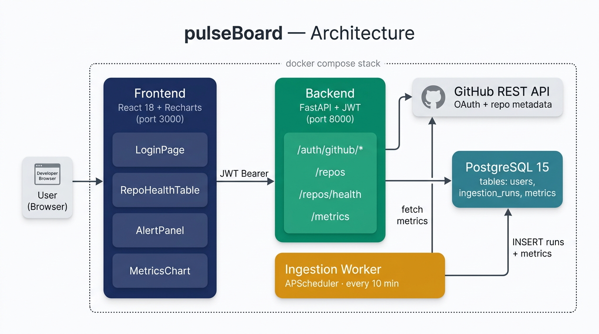

# pulseBoard

> A self-hosted GitHub repository health dashboard. Log in once, watch your repos.

pulseBoard ingests GitHub metrics on a schedule, stores them in Postgres, and
serves a live dashboard with per-repo health (green/yellow/red), threshold
alerts, and a time-series chart per metric. The whole thing boots from a
single `docker compose up`.



---

## Features

- **GitHub OAuth login** — no passwords, JWT signed by the backend.
- **Background ingestion** — APScheduler runs inside the FastAPI backend and polls GitHub every 10 min for each linked user's owned, non-fork repos. A daemon thread also fires one run immediately on boot.
- **Four metrics per repo** — `weekly_commit_count`, `open_issues_count`, `avg_pr_merge_time_hours`, `weekly_code_additions`.
- **Health rollup + alerts** — `/repos/health` merges run status, data freshness, and threshold breaches into a single green/yellow/red; the Alerts panel flags any metric crossing a configurable threshold.
- **Time-series chart** with 24h / 7d / 30d / all time ranges.
- **Seed Demo Data button** — one click calls `POST /debug/seed`, which writes 30 days of synthetic metrics across three `demo/*` repos so you can explore the UI without waiting for GitHub.
- **Graceful failure UI** — loading spinners, retry buttons, empty states, and a stale-data warning banner.

---

## Architecture

Three containers via `docker compose`:

| Service | Port | Role |
|---|---|---|
| `db` (`postgres:15`) | `5432` | `users`, `ingestion_runs`, `metrics`. Schema from `db/init.sql`. |
| `backend` (`backend/Dockerfile`) | `8000` | FastAPI — OAuth, JWT, `/repos`, `/repos/health`, `/metrics`, `/debug/seed`, plus the in-process APScheduler. |
| `frontend` (`frontend/Dockerfile`) | `3000` | React SPA. Polls the backend every 60s. |

Ingestion lives in `backend/ingestion/` and can also be invoked one-shot
(`python -m ingestion.main --once`) for cron-style deploys — that's what the
included `render.yaml` does.

**Tech:** FastAPI, APScheduler, `psycopg2`, `python-jose`, Pydantic • PostgreSQL 15 • React 18, React Router 7, Recharts, `jwt-decode` • Docker Compose.

---

## Project structure

```
pulseBoard/
├─ backend/
│  ├─ auth.py             # OAuth, JWT, startup hook (boots APScheduler)
│  ├─ routes.py           # /repos, /repos/health, /metrics, /debug/seed
│  ├─ db_bootstrap.py     # Idempotent schema bootstrap on startup
│  ├─ seed_data.py        # Standalone CLI that seeds 30 days of demo data
│  └─ ingestion/          # APScheduler worker package (supports --once)
├─ frontend/              # React SPA (LoginPage, DashboardPage, etc.)
├─ db/init.sql
├─ docker-compose.yml
├─ render.yaml            # Render Blueprint for production
└─ README.md
```

---

## Quick start

1. **Create a GitHub OAuth App** — Homepage `http://localhost:3000`, callback `http://localhost:8000/auth/github/callback`. Save the Client ID + Secret.
2. **Create `backend/.env`:**

   ```env
   POSTGRES_USER=admin
   POSTGRES_PASSWORD=secret
   POSTGRES_DB=pulseboard
   DATABASE_URL=postgresql://admin:secret@db:5432/pulseboard

   GITHUB_CLIENT_ID=...
   GITHUB_CLIENT_SECRET=...
   GITHUB_REDIRECT_URI=http://localhost:8000/auth/github/callback
   FRONTEND_URL=http://localhost:3000

   SECRET_KEY=$(python3 -c "import secrets; print(secrets.token_hex(32))")
   ```

   (Optional) copy `frontend/.env.example` to `frontend/.env` to override `REACT_APP_BACKEND_URL`.

3. **Boot the stack:**

   ```bash
   docker compose up --build
   ```

4. Open `http://localhost:3000` → **Login with GitHub**.

   The first ingestion runs on startup, but GitHub's `stats/*` endpoints can
   take a minute to warm up. If you don't want to wait (or your account has no
   public repos), click **Seed Demo Data** in the dashboard header — instant
   30 days of synthetic data.

**Reset everything:** `docker compose down -v`

---

## How it works

**Health rollup** — per-repo status is the *worst* of three signals:

| Signal | `red` | `yellow` | `green` |
|---|---|---|---|
| Last run status | `error` | `partial` | `success` |
| Data freshness | ≥ 120 min | ≥ 30 min or no run yet | < 30 min |
| Threshold breaches | any `critical` | any `warning` | none |

**Alert thresholds** (in `backend/routes.py`):

| Metric | Direction | Warn | Critical |
|---|---|---|---|
| `open_issues_count` | high is bad | ≥ 50 | ≥ 200 |
| `avg_pr_merge_time_hours` | high is bad | ≥ 72 | ≥ 168 |
| `weekly_commit_count` | low is bad | ≤ 1 | ≤ 0 |

**Ingestion atomicity** — each repo gets one `ingestion_runs` row; all four metric inserts happen in a single transaction and are rolled back + marked `error` on any fetch failure so other repos are unaffected.

---

## Design decisions

- **Polling, not websockets.** Ingestion runs every 10 min, so 60s polling is "good enough" and keeps the backend stateless.
- **JWT in `localStorage`.** Accepted XSS tradeoff for a portfolio project — the GitHub access token never leaves the DB, only a username is in the JWT. Prod would use an HttpOnly cookie + refresh endpoint.
- **APScheduler in the backend process.** Collapsed the old ingestion sidecar into zero extra moving parts. Same module also runs as a one-shot cron (`--once`) on Render.
- **Sync `requests`/`psycopg2` in async endpoints.** Blocks the event loop, but fine at 1-user scale. Prod would use `httpx.AsyncClient` + `asyncpg` or `run_in_threadpool`.
- **No GitHub repo-list cache yet.** `/repos/health` re-hits GitHub each poll; next step is a short-TTL cache with a DB fallback on 5xx.
- **Health rollup computed on read.** Always consistent with the latest thresholds; cost is one tiny query per request.
- **Inline styles.** Kept the React side framework-free; would move to design tokens + a styling library if it grew.
- **Pydantic at the write boundary only.** `MetricRecord` validates ingested metrics before insert; the API reads straight from the DB.

---

## Deployment

Free-tier target: **Vercel** (SPA) + **Render** (backend Web Service + optional cron) + **Neon** (Postgres). Total cost: $0/month.

1. **Neon** — create a project, copy the connection string (this is your `DATABASE_URL`). Schema bootstraps itself on backend startup.
2. **Render** — **New → Blueprint**, point at your fork. `render.yaml` provisions the backend Web Service and the ingestion Cron Job. Set these env vars on the backend: `DATABASE_URL`, `GITHUB_CLIENT_ID`, `GITHUB_CLIENT_SECRET`, `GITHUB_REDIRECT_URI`, `FRONTEND_URL` (`SECRET_KEY` is auto-generated). Set `DATABASE_URL` on the cron job too.
3. **Production GitHub OAuth App** — separate from your local one. Homepage = Vercel URL, callback = `https://<render-backend>/auth/github/callback`.
4. **Vercel** — import the repo, **Root Directory** `frontend`, set `REACT_APP_BACKEND_URL=https://<render-backend>`. Deploy.
5. Back on Render, set `FRONTEND_URL` to the Vercel URL (comma-separated list is supported for preview deploys; first entry is the canonical OAuth redirect).

**Verify:**

```bash
curl https://<render-backend>/health   # → {"status":"ok"}
curl https://<render-backend>/repos    # → 401 (auth gate works)
```

Heads up: Render free web services cold-start after ~15 min idle (~30s first request). The dashboard stays warm via the 60s poll once it's open. To kick off ingestion immediately, trigger the `pulseboard-ingestion` cron run from the Render dashboard.

---

## Roadmap

- [ ] Tests (backend unit + integration, frontend component tests).
- [ ] Per-user `/repos` cache with DB fallback on GitHub 5xx.
- [ ] Per-user / per-repo configurable thresholds.
- [ ] HttpOnly cookie auth + refresh tokens.
- [ ] More metrics (PR review latency, CI pass rate via Checks API, issue close time).
- [ ] GitHub Actions CI (lint, test, build images).

---

## License

MIT. Use it, fork it, learn from it.
